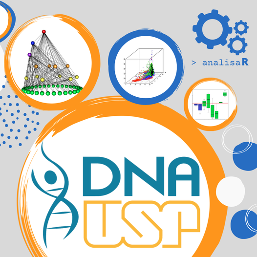

## Sobre a empresa

A analisaR é um empresa recém-criada para a prestação de serviços em análise e visualização de dados socioambientais e de biodiversidade. A empresa tem nome de mulher e a letra R foi acrescentada para indicar que trabalhamos com o R, uma linguagem de código aberto que garante a transparência e a reprodutibilidade nos resultados gerados. A tipografia da nossa logo mistura caracteres que simbolizam o ambiente de trabalho dentro do R. As cores cinza e azul também são as mesmas encontradas na paleta de cores da logomarca do R. A engrenagem significa "análises rodando", uma gíria utilizada na modelagem estatística. 

## Serviços oferecidos

- Estruturação de banco de dados 

- Gerenciamento de base de dados

- Análises exploratórias

- Análises quantitativas e qualitativas

- Modelagem estatística

- Assessoria em análise de dados

### Empresa com DNA USP

 

A analisaR é uma [empresa com o DNA USP](https://hubusp.inovacao.usp.br/empresas)! Prestamos serviços em análise e visualização de dados socioambientais e de biodiversidade garantindo a transparência e a reprodutibilidade dos resultados gerados.

## Nossos clientes

#### Grupo NSC (FIP Avaliação)

Por meio do Grupo Natureza, Conservação e Sociedade (Grupo NSC), analisamos os indicadores de resultados, desempenho e impacto de oito mega projetos no Cerrado que fazem parte do [PIB/FIP (Plano de Investimentos do Brasil para o Fundo de Investimento Florestal)](http://fip.mma.gov.br). Uma grande oportunidade para avaliarmos o sucesso das ações de conservação promovidas por essa iniciativa do governo federal e que faz parte de um programa internacional de longo prazo. 

Confira a primeira [reunião online](http://fip.mma.gov.br/projetos-do-fundo-de-investimento-florestal-passam-por-avaliacao-de-impactos/?fbclid=IwAR0vfrFKP9KaiYg08k-AHv5AxHh_lixam-xD4G3TCxfTDpviXUojWry8dIs) entre (i) o FIP Avaliação, (ii) o FIP Coordenação representado pela [Funatura](https://www.funatura.org.br) e (iii) os gestores dos oito projetos do programa. Trabalhamos com nove camadas de análise e mais de dez interações entre modalidades e componentes de avaliação. 

#### Instituto Onça-pintada 

Analisamos dados de movimento das onças-pintadas monitoradas com colares GPS pelo Projeto Corredor das Onças do Instituto Onça-pintada (IOP). 

## Mídias sociais

[Twitter](https://twitter.com/analisaR_dados)

[Instagram](https://www.instagram.com/analisar_dados) 

[Facebook](https://www.facebook.com/analisaR.dadosambientais)

## Contato

A analisaR é um empresa idealizada por [Francesca Palmeira](mailto:francesca@alumni.usp.br), uma mistura de bióloga de campo e de computador com mais de vinte anos de experiência em atividades de pesquisa, ensino e extensão.

Website: [fblpalmeira.github.io](https://fblpalmeira.github.io) 

Email: [francesca@alumni.usp.br](mailto:francesca@alumni.usp.br)

## Suporte

A manutenção desta página também é feita por [Francesca Palmeira](mailto:francesca@alumni.usp.br).
